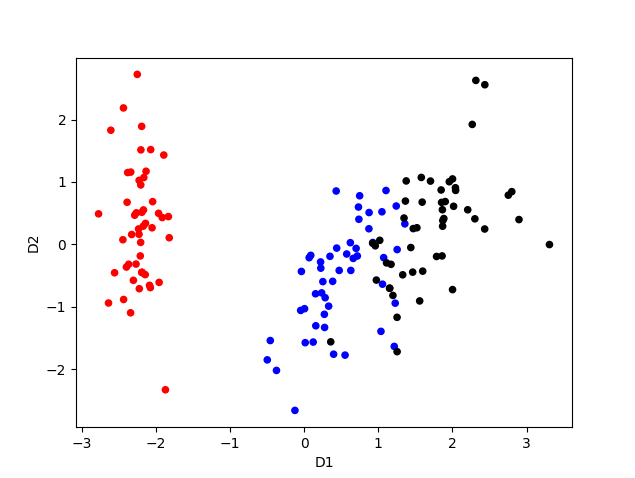
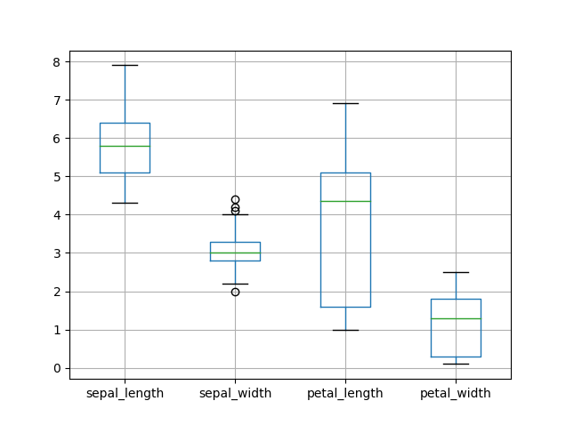

# preprocessing on a flower iris dataset
The iris.data file is a tedious `.csv` that looks something like this
```csv
6.1,3,4.9,1.8,Iris-virginica
6.4,2.8,5.6,2.2,Iris-virginica
6.2,3.4,5.4,2,
6.3,2.8,5.1,1.5,Iris-virginica
7.7,3,6.1,2.3,Iris-virginica
,3,6.1,2.3,Iris-virginica
6.4,3.1,5.5,1.8,Iris-virginica
```
The data is read, cleaned, normalized, two features are extracted and plotted in two
scatter and box charts, as seen below:





libraries used:
```python
pandas~=1.4.2
matplotlib~=3.5.1
scikit-learn~=1.0.2
setuptools==62.0.0
```